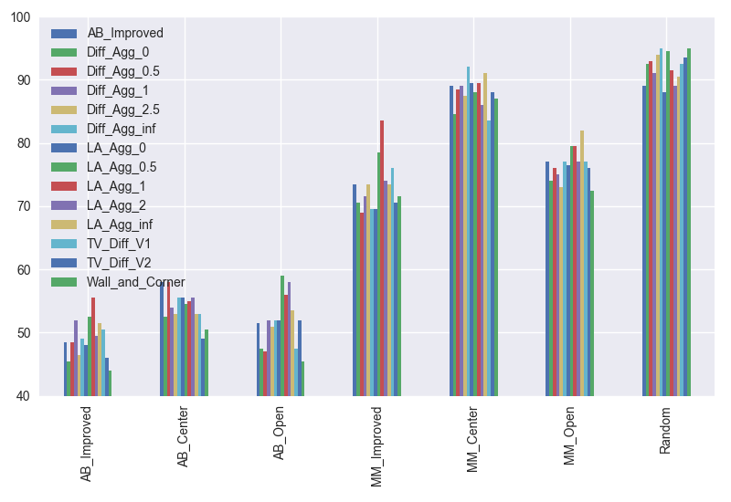
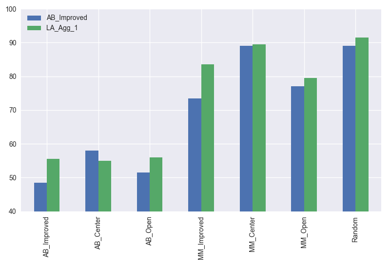

# Heuristic Analysis

## Introduction
This document describes the comparison and analysis of several parameterised heuristics in their performance in playing Knight Isolation. The evaluation method is running a tournament agains several benchmark players. Each match starts with a randomly initialized game board, and each player pair with get to play the game twice as 1st player and 2nd player respectively for the match to be fair.

The custom players are defined in [game_agent.py](game_agent.py)

The benchmark players are defined in [sample_players.py](sample_players.py)

The tournament is run by [tournament.py](tournament.py) (a number of revisions are made to the original file in order to run more than three custom players)

## Benchmark players

  * **Random**: player that selects next move randomly without tree search
  * **MM_Open**: player use minimax for search and score moves based on the number of available next moves
  * **MM_Center**: player use minimax for search and score moves based on distance to center 
  * **MM_Improved**: player use minimax for search and score moves based on own number of available moves minus opponent's number of available moves
  * **AB_Open**: same as MM_Open but has alpha-beta pruning and iterative deepening
  * **AB_Center**: same as MM_Center but has alpha-beta pruning and iterative deepening
  * **AB_Improved**: same as MM_Improved but has alpha-beta pruning and iterative deepening


## Custom players

All custom players will use alpha-beta pruning and iterative deepening by default.

### 1. Diff_Agg_{*aggressiveness*}

This set of players call game_agent.score_differential_open_move() with parameter aggressiveness. 
```math #yourmathlabel
score = number_of_own_open_moves - aggressiveness * number_of_opponent_open_moves
```
Here we will study the following cases
  * aggressiveness = 0: this is equivalent to the AB_Open case
  * aggressiveness = 1: this is equivalent to the AB_Improved case
  * aggressiveness = 2.5: more aggressive case
  * aggressiveness = 0.5: less aggressive case
  * aggressiveness = 1e6: this is similar to setting score = - number_of_opponent_open_moves, i.e. soley focused on chasing opponent out of open moves
  
### 2. TV_Diff_V1 and TV_Diff_V2

These two players are time-variant (TV) differential score. The players have a aggressiveness setting based on the stage of the game (calculated by the percentage of blank positions on the board). TV_Diff_V1 uses aggressiveness of 2.5 in the first half of the game and aggressiveness of 0.5 in the second half of the game. TV_Diff_V2 is exactly the opposite.

### 3. LA_Diff_{*aggressiveness*}

This set of players call game_agent.score_look_ahead_differential_move() with parameter aggressiveness. Instead of looking at the available next moves, we look one step further. 

For this player, we scan aggressiveness = 0, 0.5, 1, 2, 1e6. The aggressiveness has the same meaning as explained in Diff_Agg_{*aggressiveness*} section.

### 4. Wall and corner aware player

Out of curiosity, I implemented a variant of what was described here
https://github.com/arjunmitrareddy/Artifical-Intelligence---Isolation-Game-Agent/blob/master/game_agent.py

The function is game_agent.score_wall_corner_aware_differential_open_move()


## Results and discussions

Due to the close scores in some of the player pairs a large number of matches were executed to reduce the random fluctuations seen in tournament with a small number of matches (20~50). 

The results from a tournament of 19600 matches (7 benchmark players x 14 custom players x 200 matches) are summarized below.

**Diff_Agg_{x} players**
```
 Match #   Opponent    AB_Improved  Diff_Agg_0  Diff_Agg_0.5  Diff_Agg_1  Diff_Agg_2.5 Diff_Agg_inf  
                        Won | Lost   Won | Lost   Won | Lost   Won | Lost   Won | Lost   Won | Lost  
    1     AB_Improved   97  |  103   91  |  109   97  |  103   104 |  96    93  |  107   98  |  102  
    2      AB_Center    116 |  84    105 |  95    116 |  84    108 |  92    106 |  94    111 |  89   
    3       AB_Open     103 |  97    95  |  105   94  |  106   104 |  96    102 |  98    104 |  96   
    4     MM_Improved   147 |  53    141 |  59    138 |  62    143 |  57    147 |  53    139 |  61   
    5      MM_Center    178 |  22    169 |  31    177 |  23    178 |  22    175 |  25    184 |  16   
    6       MM_Open     154 |  46    148 |  52    152 |  48    150 |  50    146 |  54    154 |  46   
    7       Random      178 |  22    185 |  15    186 |  14    182 |  18    188 |  12    190 |  10   
-----------------------------------------------------------------------------------------------------
           Win Rate:      69.5%        66.7%        68.6%        69.2%        68.4%        70.0%     
```
**TV_Diff_{x} and Wall_and_Corner players**
```
 Match #   Opponent    AB_Improved  TV_Diff_V1   TV_Diff_V2   Wall_and_Corner
                        Won | Lost   Won | Lost   Won | Lost    Won | Lost
    1     AB_Improved   97  |  103   101 |  99    92  |  108    88  |  112
    2      AB_Center    116 |  84    106 |  94    98  |  102    101 |  99
    3       AB_Open     103 |  97    95  |  105   104 |  96     91  |  109
    4     MM_Improved   147 |  53    152 |  48    141 |  59     143 |  57
    5      MM_Center    178 |  22    167 |  33    176 |  24     174 |  26
    6       MM_Open     154 |  46    154 |  46    152 |  48     145 |  55
    7       Random      178 |  22    185 |  15    187 |  13     190 |  10
---------------------------------------------------------------------------
           Win Rate:      69.5%        68.6%        67.9%         66.6%
```

**LA_Agg_{x} players**
```
 Match #   Opponent    AB_Improved   LA_Agg_0    LA_Agg_0.5    LA_Agg_1     LA_Agg_2    LA_Agg_inf  
                        Won | Lost   Won | Lost   Won | Lost   Won | Lost   Won | Lost   Won | Lost 
    1     AB_Improved   97  |  103   96  |  104   105 |  95    111 |  89    99  |  101   103 |  97  
    2      AB_Center    116 |  84    111 |  89    109 |  91    110 |  90    111 |  89    106 |  94  
    3       AB_Open     103 |  97    104 |  96    118 |  82    112 |  88    116 |  84    107 |  93  
    4     MM_Improved   147 |  53    139 |  61    157 |  43    167 |  33    148 |  52    147 |  53  
    5      MM_Center    178 |  22    179 |  21    176 |  24    179 |  21    172 |  28    182 |  18  
    6       MM_Open     154 |  46    153 |  47    159 |  41    159 |  41    154 |  46    164 |  36  
    7       Random      178 |  22    176 |  24    189 |  11    183 |  17    178 |  22    181 |  19  
----------------------------------------------------------------------------------------------------
           Win Rate:      69.5%        68.4%        72.4%        72.9%        69.9%        70.7%    
```



(Y axis is win rate in %)

Considering the overall win rates: 

  * Diff_Agg_{x} did not show significant improvement over AB_Improved (equivalent to aggressiveness=1). With a setting of totally aggressive, i.e. aggressiveness = 1e6 (inf) being slightly better.
  * The time-variant players also did not show benefit over AB_Improved either, related to the lack of performance in Diff_Agg_{x}.
  * The look-ahead players LA_Agg_{x} consistently outperform AB_Improved with LA_Agg_1 being the best choice. 
  * The wall and corner aware player did not perform well, at least partially due to high complexity in evaluation.
  
  
Overall, I choose LA_Agg_1 as the best heuristic, with the following reasons:
  * The overall win rates clearly indicate LA_Agg_1 is the best performing heuristic. 
  * In addition, several aggressiveness settings under this player family yielded top win rates - somewhat suggesting robustness with this heuristic.
  * The look-ahead action in LA_Agg_{x} is intuitive. It is a more complex evaluation compared to Diff_Agg{x} and TV_Diff_{x}, but the look-ahead action proves to indeed add game-play advantage.
  * The look-ahead is different than searching one more depth because the board remains unchanged in such look-ahead action. So, the look-ahead of available next-next moves is only an estimate. This turned out to be a good tradeoff in terms of keep computation complexity low enough to go deeper with limited time. This might be the reason wall and corner aware player did not perform well due to overly complex evaluation functions.

Here is a side-by-side comparison to AB_Improved on the win rate versus all the benchmark players



(Y axis is win rate in %)
